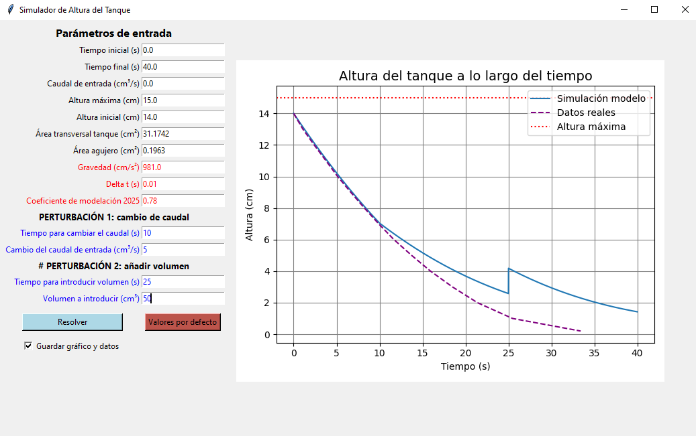

# 🚰 Simulador de Altura en Tanque Vertical

[](https://www.python.org/)
[]()
[](LICENSE)

<p>
Este proyecto simula el comportamiento del nivel de líquido en un tanque vertical con entrada y salida de fluido, resolviendo una ecuación diferencial mediante el método de Runge-Kutta de 4to orden (RK4). La interfaz gráfica está desarrollada con `Tkinter` y permite ingresar parámetros para visualizar el comportamiento dinámico del sistema.
</p>

 
---
## ⚙️ Tecnologías utilizadas

- **Python 3.10+**
- **Tkinter** – Para la interfaz gráfica de usuario.
- **Matplotlib** – Para la generación de gráficos.
- **csv** (módulo estándar) – Para guardar resultados de las simulaciones.
- **datetime** (módulo estándar) – Para el control de fechas y archivos.
---
## 🧮 Ecuación diferencial empleada
$$
\frac{dh}{dt} = \frac{1}{A_T} \left( Q_e - CM \cdot A_0 \cdot \sqrt{2 \cdot g \cdot h} \right)
$$

---
## ▶️ Forma de uso

1. **Clona o descarga** este repositorio:
   ```bash
   git clone https://github.com/Juda-Tech-Green/pvi-vaceado-tanque.git
   cd pvi-vaceado-tanque
   ```
2. **Ejecuta la aplicación**
```bash
    python main.py
```
3. **En la interfaz:**
    - Ingresa los parámetro del sistema.
    - Selecciona si deseas guardar el gráfico.
    - Presiona el botón para simular.
4. Si marcaste "Guardar gráfico y datos", los 3 archivos se almacenarán en la carpeta ``` /resultados``` con la fecha y hora de la simulación.
---
## 📂 Estructura del Proyecto
```bash
├── Rk4.py # Contiene la lógica para resolver el PVI 
├── main.py # Interfaz gráfica del usuario con Tkinter 
├── README.md # Este archivo 
├── datos_realidad_sin_per.csv # Datos medido en modelo físico sin perturbaciones
├── preview.PNG  # Imagen de ejemplo de la interfaz
├── resultados  #Carpeta que contendrá gráficos.png, datos de entrada en csv y resultados de tiempo y altura en csv.
└── valores_defecto.csv  # Archivo con parámetros por defecto
```
---
## 💡 ¿Por qué construí esto?
<p>
Este proyecto nace de una necesidad académica y profesional de representar visualmente sistemas de vaciado de tanques —un fenómeno común en la ingeniería ambiental e hidráulica. El objetivo es proporcionar una herramienta práctica y didáctica para explorar el comportamiento dinámico de un tanque ante diferentes condiciones de entrada y salida de caudal.
Además, sirve como una introducción funcional al uso de métodos numéricos como Runge-Kutta (RK4) con visualización gráfica en Python.
</p>

## 📜 Licencia
MIT © [JuDa](https://github.com/Juda-Tech-Green)
Hecho con 💚 & Python


